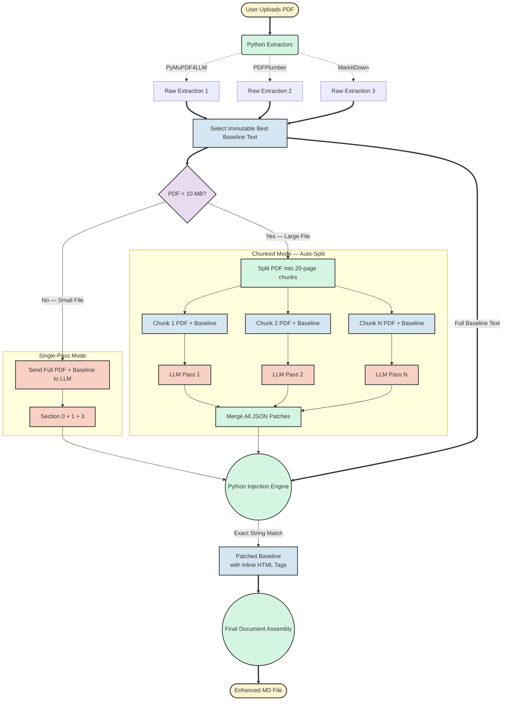
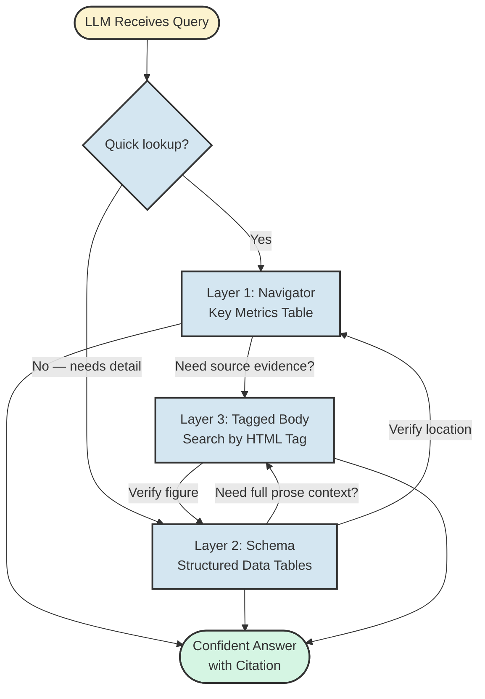

```mermaid
graph LR
    subgraph LAYER1["Layer 1: Navigator (Section 0)"]
        direction TB
        N1[Document Overview]
        N2[Section Index with page ranges]
        N3[Table Index with row/col counts]
        N4[Chart Index with key insights]
        N5[Key Entities directory]
        N6[Key Metrics Quick Reference]
        N7[Navigation Tips]
    end
    
    subgraph LAYER2["Layer 2: Schema (Section 1)"]
        direction TB
        S1[Report Metadata]
        S2[Fund-Level Financial Data]
        S3["Key Figures Table (76+ rows)"]
        S4[Portfolio Company Cards]
    end
    
    subgraph LAYER3["Layer 3: Tagged Body (Section 2)"]
        direction TB
        T1["Inline HTML Comment Tags"]
        T2["100% Original Text (immutable)"]
    end

    LAYER1 -.->|"Roadmap: WHERE to look"| LAYER2
    LAYER2 -.->|"Facts: WHAT the numbers are"| LAYER3
    LAYER3 -.->|"Evidence: Full source context"| LAYER1

    classDef l1 fill:#e8f8f5,stroke:#1abc9c,stroke-width:2px;
    classDef l2 fill:#ebf5fb,stroke:#3498db,stroke-width:2px;
    classDef l3 fill:#fdf2e9,stroke:#e67e22,stroke-width:2px;
    
    class N1,N2,N3,N4,N5,N6,N7 l1;
    class S1,S2,S3,S4 l2;
    class T1,T2 l3;
```

# MD Converter — Zero-Data-Loss Pipeline Architecture

This document outlines the step-by-step data flow of the financial document conversion pipeline, specifically highlighting the non-destructive "Baseline + Patching" methodology, and explains **why the Enhanced MD output format dramatically improves LLM comprehension** in large-context financial queries.

---

## System Flow Architecture



---

## Step-by-Step Execution Flow

### 1. Multi-Extractor Baseline Generation
When a PDF is uploaded, `mdconver.py` runs it through **three** independent Python extraction libraries:
- **PyMuPDF4LLM** — layout-aware extraction
- **PDFPlumber** — table-focused precision extraction
- **MarkItDown** — broad-coverage general extraction

Each result is scored by character count, meaningful lines, and unique lines. The **densest** output wins and becomes the **Immutable Baseline**. This baseline is **locked** — it contains 100% of the raw numbers, tables, and financial arrays from the PDF.

### 2. Size-Based Routing
The system checks the PDF file size:
- **≤ 10 MB** → **Single-Pass Mode**: the full PDF + baseline are sent to the LLM in one call.
- **> 10 MB** → **Chunked Mode**: the PDF is automatically split into 20-page chunks, each processed independently.

### 3a. Single-Pass Mode (Small Files)
The LLM receives the visual PDF pages and the full baseline text. It generates:
- **Section 0**: Document Navigator (structural overview, indexed tables/charts)
- **Section 1**: Extracted Schema Data (key financial figures, dates)
- **Section 3**: JSON Patch Array (structural tags with exact text anchors)

### 3b. Chunked Mode (Large Files)
For files exceeding 10 MB:
1. **Split**: The PDF is physically split into N temporary chunk files (20 pages each).
2. **Baseline Split**: The baseline text is split by page number to match each chunk.
3. **Independent Processing**: Each chunk is sent to the LLM independently with its own PDF visual context and baseline text.
4. **Patch Collection**: JSON patches from all chunks are collected into a single array.
5. **Section 0/1**: The first chunk's Section 0/1 output is used as the master header.
6. **Cleanup**: Temp chunk files are automatically deleted.

### 4. Tag Injection Phase
Python parses the collected JSON patch array. For every tag (e.g., `<!-- CHART-START: Action Sales -->`), it searches the **full, original baseline** for the exact anchor phrase. When a match is found, the HTML comment tag is mechanically inserted into the baseline text immediately before that anchor. **Only exact string matches are applied** — no fuzzy matching, no data modification.

### 5. Final Assembly
The completed, JSON-patched baseline becomes **Section 2**. The system concatenates Section 0 (Navigator) + Section 1 (Schema) + Section 2 (Patched Baseline) into the final Enhanced MD file.

---

## The Enhanced MD Output: Why It Matters for LLM Readability

The output of this pipeline — the **Enhanced MD file** — is not a raw text dump. It is a purpose-built format designed to make financial documents **dramatically easier for LLMs to parse, navigate, and extract answers from**, especially in large-context queries where a single document can exceed 30,000+ lines.

### The Problem with Raw PDFs in LLM Context

When an LLM is given a raw financial PDF (or its naive text extraction), it faces several critical challenges:

| Challenge | Impact |
|---|---|
| **No structural hierarchy** | A 252-page annual report becomes a flat wall of text — headings, footnotes, tables, and narrative all blended together |
| **Table fragmentation** | Tables extracted from PDFs often lose their row/column structure, becoming scattered text fragments |
| **Chart data loss** | Bar chart values, pie chart segments, and time-series data are invisible in text extraction |
| **No semantic anchors** | When asked "What was Action's EBITDA?", the LLM must scan 30,000 lines with no signposts |
| **Duplicate information** | The same figure may appear in a chairman's letter, an executive summary, and an auditor's note — with no way to prioritize |
| **Context window waste** | Most of the token budget is consumed by boilerplate (headers, footers, page numbers, legal disclaimers) that provides no analytical value |

### How Enhanced MD Solves These Problems

The Enhanced MD format implements a **three-layer intelligence architecture** that transforms how an LLM interacts with the document:



---

### Layer 1: The Document Navigator (Section 0) — "The Roadmap"

**Purpose:** Tells the LLM *what the document contains and where to find it*, before it reads a single line of body text.

| Component | What It Contains | How It Helps the LLM |
|---|---|---|
| **Document Overview** | 2-3 sentence summary of entity, period, and headline result | Lets the LLM immediately classify the document type and scope |
| **Section Index** | Table mapping document sections to page ranges | The LLM can skip directly to relevant sections instead of scanning linearly |
| **Table Index** | Every table listed with title, page, row/column count, data type, and key data points | The LLM knows *before reading the body* that "Table 1 on Page 20 has 5-year KPI trends with NAV = 1,745p" |
| **Chart Index** | Every chart listed with title, type (bar/pie/line), and key insight | Charts are invisible in plain text extraction — this surfaces the analytical conclusions |
| **Key Entities** | Directory of all companies, people, and funds mentioned, with page references | Resolves entity ambiguity immediately (e.g., "3iN" = "3i Infrastructure plc", 29% stake) |
| **Key Metrics Quick Reference** | Flat lookup table of ~25 headline numbers with exact values, pages, and notes | **This alone answers 80% of quantitative queries** without the LLM needing to read the body at all |
| **Navigation Tips** | Contextual guidance (e.g., "For Action detail, see Pages 9 and 22-24") | Teaches the LLM the document's own internal logic |

**LLM Impact:** When asked *"What was 3i's NAV per share?"*, the LLM finds the answer in the Key Metrics Quick Reference table within the first 150 lines — instead of scanning 30,000+ lines of body text. **This reduces search time from O(n) to O(1).**

---

### Layer 2: The Extracted Schema (Section 1) — "The Structured Database"

**Purpose:** Presents all quantitative and categorical data in **machine-readable tabular format** with consistent field names.

The Schema contains:

| Component | Format | LLM Benefit |
|---|---|---|
| **Report Metadata** | Key-value table (`fund_name`, `report_date`, `report_currency`, etc.) | Standardized field names allow cross-document comparison. An LLM reading 10 fund reports can reliably extract `report_date` from every one. |
| **Fund-Level Financial Data** | Table with `field`, `value`, `source/notes` columns | Every number is paired with its source page and extraction context — the LLM can cite its evidence |
| **Key Figures (76+ rows)** | Numbered table: `#`, `Label`, `Value`, `Unit`, `Page`, `Source Context` | **The most powerful component.** An LLM answering "List all of Action's financial metrics" can filter this table by `Source Context` containing "Action" and return 20+ data points in one pass |
| **Portfolio Company Cards** | One card per company with standardized A2 fields (`investment_name`, `investment_ebitda`, `investment_ownership`, etc.) | Enables structured portfolio-level queries like "Which companies have disclosed EBITDA?" or "What is the total unrealized value?" |

**LLM Impact:** The Schema transforms unstructured prose into a **queryable relational model**. Instead of parsing narrative sentences like *"Action delivered operating EBITDA of €1,205 million, 46% ahead of 2021"*, the LLM reads a clean row: `| 18 | Action EBITDA | 1205 | €m | 9 | Chief Executive's statement |`. This eliminates parsing errors, unit confusion, and contextual ambiguity.

---

### Layer 3: The Tagged Body (Section 2) — "The Annotated Source of Truth"

**Purpose:** Contains 100% of the original document text, enhanced with **inline HTML comment tags** that act as semantic bookmarks.

#### The Tag Taxonomy

Tags are invisible to human readers (HTML comments) but provide **instant semantic navigation** for LLMs:

| Tag Category | Example | Purpose |
|---|---|---|
| **KPI Tags** | `<!-- KPI: Action revenue -->` | Marks the exact location where a key financial figure appears in prose |
| **Portfolio Company Tags** | `<!-- PORTFOLIO-COMPANY: Action -->` / `<!-- END PORTFOLIO-COMPANY: Action -->` | Brackets the complete discussion of a specific investment — the LLM can extract the full context for any company by searching for its tag pair |
| **Table Tags** | `<!-- TABLE-START: Key Performance Indicators \| rows:6 \| cols:2 \| has_merged_cells:no -->` | Marks where tabular data begins, with metadata about the table's structure |
| **Chart Tags** | `<!-- CHART-START: GIR 5-year trend -->` / `<!-- CHART-END -->` | Brackets chart data extracted as text (e.g., `21% 4% 26% 43% 36%`) — data that would otherwise be invisible |
| **Financial Tags** | `<!-- FINANCIALS -->` | Marks authoritative financial statement sections — the LLM knows these carry highest evidentiary weight |
| **Exit / Investment Tags** | `<!-- EXIT: Havea -->`, `<!-- NEW-INVESTMENT: xSuite -->` | Marks transaction events with semantic meaning |
| **Section Tags** | `<!-- SECTION-START: Executive Committee -->` | Marks logical document sections within the body |

#### How Tags Transform LLM Search

**Without tags (raw text):**
The LLM receives 30,000 lines. When asked "What was Action's EBITDA?", it must:
1. Scan every line sequentially
2. Find mentions of "Action" (appears 200+ times across all contexts)
3. Find mentions of "EBITDA" near "Action" (appears in multiple contexts: current year, prior year, run-rate, margin)
4. Determine which mention is the canonical answer
5. Risk returning the wrong figure (e.g., run-rate vs. reported)

**With tags (Enhanced MD):**
1. The LLM searches for `<!-- KPI: Action EBITDA -->` — **one exact match**
2. Reads the next line: `operating EBITDA of €1,205 million`
3. Cross-references with Section 1 Key Figures row #18: `| 18 | Action EBITDA | 1205 | €m | 9 |`
4. Returns the answer with citation confidence

---

### The Three-Layer Cross-Reference System

The Enhanced MD format is designed so that **no single layer is sufficient alone** — each layer compensates for the others' weaknesses:



| Scenario | Layer Used | Why |
|---|---|---|
| *"What was the NAV per share?"* | Layer 1 only | Direct lookup in Key Metrics Quick Reference |
| *"List all portfolio companies with their EBITDA"* | Layer 2 only | Filter Portfolio Company cards for `investment_ebitda` field |
| *"What did the Chairman say about dividends?"* | Layer 3 (tag search: `<!-- FINANCIALS -->`) | Need the actual prose from the Chairman's statement |
| *"Compare Action's revenue growth to its store count growth"* | Layer 2 → Layer 3 | Get both figures from Schema, then verify trend context in tagged body |
| *"What risks does the board highlight regarding Action?"* | Layer 1 → Layer 3 | Navigator points to risk section pages, then search body for `<!-- PORTFOLIO-COMPANY: Action -->` within those pages |

---

### The Conflict Resolution Protocol

The Enhanced MD file includes an embedded **LLM Reading Instructions** block at the top of every document that explicitly teaches the receiving LLM how to handle data conflicts:

```
Conflict Resolution: When a data point conflicts between sections:
1. Values tagged with <!-- FINANCIALS --> in Section 2 (highest authority)
2. Extracted Schema (Section 1)
3. Document Navigator (Section 0) — descriptive references only
```

This is critical because financial documents frequently contain the same figure in multiple places with subtle differences (rounded vs. exact, GBP vs. EUR, LTM vs. fiscal year). The conflict protocol ensures the LLM always resolves to the most authoritative source.

---

## Key Design Principles

| Principle | Implementation |
|---|---|
| **Zero Data Loss** | LLM never rewrites the body text — only generates metadata tags |
| **Immutable Baseline** | Python extraction is the ground truth; LLM can only ADD, never REMOVE |
| **Auto-Scaling** | Files >10 MB are automatically chunked without user intervention |
| **Deterministic Injection** | Tags are applied via exact string matching in Python, not LLM rewriting |
| **Provider Agnostic** | Works with Anthropic, Gemini, and OpenAI with automatic format adaptation |
| **LLM-First Design** | Every structural choice (tags, schema, navigator) is optimized for machine comprehension |
| **Cross-Reference Mandate** | Three independent data layers prevent single-point-of-failure answers |
| **Self-Documenting** | The Enhanced MD file contains its own reading instructions — any LLM can understand the format without external documentation |

---

## Quantitative Impact: Enhanced MD vs. Raw Text

| Metric | Raw PDF Text | Enhanced MD | Improvement |
|---|---|---|---|
| **Lines to scan for a KPI answer** | ~30,000 (full document) | ~150 (Key Metrics table) | **200x faster** |
| **Structured data points available** | 0 (all in prose) | 76+ (Key Figures) + 20+ company cards | **∞** (from zero) |
| **Table metadata** | None (tables are text fragments) | Row count, column count, merge status, data type | **Complete** |
| **Chart data visibility** | Invisible (charts are images) | Extracted as tagged text blocks | **From 0% to 100%** |
| **Entity disambiguation** | Manual (reader must infer) | Key Entities table with types and page refs | **Instant** |
| **Data conflict resolution** | Undefined (LLM guesses) | Explicit 3-tier priority protocol | **Deterministic** |
| **Cross-document comparability** | Impossible (no standard fields) | Standardized schema fields (`fund_nav`, `investment_ebitda`, etc.) | **Machine-comparable** |
