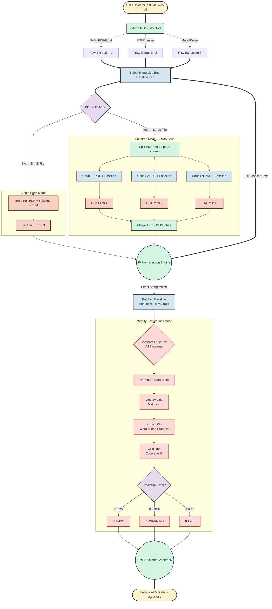
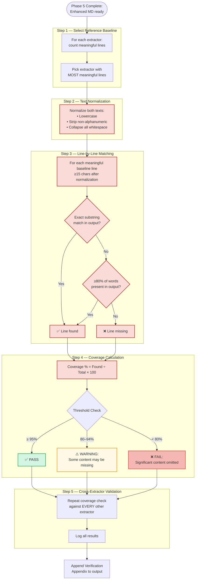

# MD Converter — Zero-Data-Loss Pipeline Architecture

This document outlines the complete architecture of the financial document conversion pipeline. It covers the non-destructive "Baseline + Patching" methodology, the multi-provider LLM integration, the web application interface, and — critically — **how the system verifies the integrity and completeness of every output**.

---

## Table of Contents

1. [System Flow Architecture](#system-flow-architecture)
2. [Application Stack](#application-stack)
3. [Step-by-Step Execution Flow](#step-by-step-execution-flow)
4. [Integrity Verification — How the App Proves Completeness](#integrity-verification--how-the-app-proves-completeness)
5. [The Enhanced MD Output Format](#the-enhanced-md-output-format)
6. [Multi-Provider LLM Support](#multi-provider-llm-support)
7. [Key Design Principles](#key-design-principles)
8. [Quantitative Impact](#quantitative-impact)

---

## System Flow Architecture



---

## Application Stack

The MD Converter is a self-contained web application with three main components:

### Web Interface (`app.py` — Flask on port 4000)

| Component | Description |
|---|---|
| **Frontend** | Single-page HTML/JS app (`templates/index.html`) with drag-and-drop upload, real-time SSE log streaming, model selection, and output file management |
| **Backend** | Flask server providing REST APIs for file upload, conversion, output listing, and log viewing |
| **Process Control** | `start` / `stop` shell scripts managing the app as a background daemon with PID tracking |

### API Endpoints

| Endpoint | Method | Purpose |
|---|---|---|
| `/api/upload` | POST | Upload one or more documents (PDF, PPTX, DOCX, XLSX) — 500 MB limit |
| `/api/uploads` | GET | List all uploaded source files |
| `/api/uploads/<filename>` | DELETE | Delete a source file |
| `/api/run` | POST | Start conversion with model selection; streams output via SSE |
| `/api/outputs` | GET | List all generated `.md` files |
| `/api/outputs/<filename>` | GET / DELETE | Download or delete an output file |
| `/api/logs` | GET | List conversion log files |
| `/api/logs/<filename>` | GET | View a specific log file |

### Processing Engine (`mdconver.py`)

The core Python script that orchestrates baseline extraction, LLM synthesis, JSON tag injection, and completeness verification. Can be run from the web UI or via CLI:

```bash
# CLI usage
python mdconver.py --model claude-opus-4-6 document.pdf
```

---

## Step-by-Step Execution Flow

### Phase 1 — Multi-Extractor Baseline Generation

When a PDF is uploaded, `mdconver.py` runs it through **three** independent Python extraction libraries **in parallel** (using `concurrent.futures.ThreadPoolExecutor`):

| Extractor | Strength | Timeout |
|---|---|---|
| **PyMuPDF4LLM** | Layout-aware, LLM-optimized markdown output | 120s |
| **PDFPlumber** | Table-focused precision extraction with row/column preservation | 120s |
| **MarkItDown** (Microsoft) | Broad-coverage general extraction | 120s |

Each result is scored using a composite algorithm:

```
Score = (unique_meaningful_lines × 100) + character_count
```

Where a "meaningful line" is ≥15 characters after normalization (lowercased, non-alphanumeric stripped, whitespace collapsed). The **highest-scoring** output becomes the **Immutable Baseline** — the ground truth text that is never modified by the LLM.

**All three raw extractions are saved** as separate files (e.g., `Report_PYMUPDF4LLM.md`, `Report_PDFPLUMBER.md`, `Report_MARKITDOWN.md`) for traceability.

### Phase 2 — Size-Based Routing

| Condition | Route | Details |
|---|---|---|
| PDF ≤ 10 MB | **Single-Pass Mode** | Full PDF + baseline sent to LLM in one call |
| PDF > 10 MB | **Chunked Mode** | Auto-split into 20-page chunks, each processed independently |

### Phase 3a — Single-Pass Synthesis (Small Files)

The LLM receives the visual PDF pages and the full baseline text. It generates three components — **not the document body**:

| Component | Purpose |
|---|---|
| **Section 0 — Document Navigator** | Structural overview: section index, table index, chart index, key entities, key metrics quick reference, navigation tips |
| **Section 1 — Extracted Schema Data** | Structured field-level data from the matched schema (A through H), plus auto-detected key figures |
| **Section 3 — JSON Patch Array** | Structural tags with exact text anchors for mechanical injection |

The LLM is explicitly instructed: _"Do NOT output Section 2 (the full text). The system will compile the final file."_

### Phase 3b — Chunked Synthesis (Large Files)

For files exceeding 10 MB:

1. **Split**: The PDF is physically split into N temporary chunk files (20 pages each) using `pypdf`.
2. **Baseline Split**: The baseline text is split **page-by-page** using `pymupdf4llm` (with `page_chunks=True`), falling back to `pdfplumber` or `pypdf` if needed. Each chunk gets only the baseline text for its pages.
3. **Independent Processing**: Each chunk is sent to the LLM independently with its own PDF visual context and its own baseline text slice.
4. **Patch Collection**: JSON patches from all chunks are collected into a single flat array.
5. **Section 0/1**: The first chunk's Section 0/1 output is used as the master header (it sees the document introduction).
6. **Rate Limiting**: 5-second pauses between chunk API calls to avoid rate limits.
7. **Cleanup**: All temp chunk files are automatically deleted.

### Phase 4 — Tag Injection (Deterministic)

Python parses the JSON patch array from the LLM output. For every tag, it:

1. Reads the `insert_before_exact_string` anchor from the patch
2. Searches the **full, original baseline** for that exact string
3. If found: inserts the HTML comment tag immediately before the anchor (first occurrence only)
4. If not found: the tag is silently skipped (no data is modified)

**Only exact string matches are applied** — no fuzzy matching, no text modification, no data rewriting.

The system logs exactly how many patches succeeded vs. total attempted (e.g., `Applied 42/47 JSON patches`).

### Phase 5 — Final Assembly

The completed file is assembled by concatenation:

```
Section 0 (Navigator) + Section 1 (Schema) + Section 3 (JSON tags — consumed)
                    ↓
+ "SECTION 2 — FULL DOCUMENT MARKDOWN" header
                    ↓
+ Patched Baseline (all original text + injected HTML comment tags)
                    ↓
+ APPENDIX — COMPLETENESS VERIFICATION (auto-generated)
```

---

## Integrity Verification — How the App Proves Completeness

This is the most critical section of the architecture. The pipeline includes an automated **completeness verification system** that runs after every conversion to prove that the Enhanced MD output contains all content from the original document.

### Why Verification Is Necessary

The pipeline's design guarantees zero data loss _by construction_ (the LLM never rewrites the body text). However, verification provides independent proof:

- The baseline extractor might have captured more text than the LLM's synthesis injected tags for
- Edge cases in PDF extraction could produce different text across extractors
- Token limits, content filters, or API errors during LLM processing could affect tag generation
- Users need auditable evidence that the output is complete

### The Verification Algorithm



### Verification Details

#### Step 1 — Reference Baseline Selection

The verifier selects the extractor that produced the **most meaningful lines** (not the one used for the baseline — it independently picks the best reference for comparison). This ensures the comparison uses the most comprehensive extraction available.

#### Step 2 — Text Normalization

Both the reference baseline and the final Enhanced MD output are normalized identically:
- Convert to lowercase
- Remove all non-alphanumeric characters (except whitespace)
- Collapse multiple spaces into single spaces
- Trim leading/trailing whitespace

This removes formatting differences (markdown syntax, HTML tags, whitespace changes) so the comparison focuses purely on **content**.

#### Step 3 — Two-Tier Matching

For each meaningful line from the reference baseline (≥15 normalized characters):

1. **Exact match**: Check if the normalized line exists as a substring anywhere in the normalized output. If yes → **found**.
2. **Fuzzy fallback**: If exact match fails and the line has ≥4 words, check if ≥80% of the individual words appear somewhere in the normalized output. If yes → **found** (covers cases where line breaks or ordering differ between extractors).
3. If both fail → **missing**.

#### Step 4 — Coverage Threshold

| Coverage | Verdict | Meaning |
|---|---|---|
| ≥ 95% | ✅ **PASS** | Output covers virtually all source text. Minor differences are acceptable (headers, footers, page numbers). |
| 80–94% | ⚠️ **WARNING** | Some content may be missing. The missing segments list should be reviewed. |
| < 80% | ❌ **FAIL** | Significant content has been omitted. The conversion should be investigated. |

#### Step 5 — Cross-Extractor Validation

After the primary check, the system also runs the same coverage calculation against **every other extractor's output**. This provides redundant verification — if the primary check shows 98% coverage but a secondary extractor shows only 85%, it may indicate that one extractor captured content the others missed.

All cross-check results are logged to the console and the run log file.

### The Completeness Appendix

Every Enhanced MD output file includes an auto-generated appendix at the bottom:

```markdown
---

# APPENDIX — COMPLETENESS VERIFICATION
<!-- COMPLETENESS-CHECK -->

> This section is auto-generated by the extraction pipeline. It compares text
> extracted via multiple Python extractors against the final Markdown output.

## Extractor Comparison

| Extractor | Characters | Meaningful Lines | Unique Lines | Status |
|---|---|---|---|---|
| pymupdf4llm | 245,823 | 3,412 | 3,201 | ✅ Best |
| pdfplumber | 198,456 | 2,987 | 2,876 | ⬜ Alt |
| markitdown | 212,345 | 3,102 | 2,945 | ⬜ Alt |

## Coverage Results

| Metric | Value |
|---|---|
| Reference extractor | pymupdf4llm |
| Baseline text segments | 3,412 |
| Found in output | 3,398 |
| Potentially missing | 14 |
| **Coverage** | **99.6%** |

> ✅ **PASS** — Output covers ≥95% of the source text.

<details>
<summary>Show 14 potentially missing segments</summary>

1. `disclaimer this document is confidential...`
2. `page 252 of 252...`
...

</details>
```

### What Gets Saved for Auditability

| Artifact | Location | Purpose |
|---|---|---|
| Enhanced MD (final output) | `Outputs/<filename>.md` | The deliverable — complete with verification appendix |
| PyMuPDF4LLM baseline | `Outputs/<filename>_PYMUPDF4LLM.md` | Raw extraction for audit comparison |
| PDFPlumber baseline | `Outputs/<filename>_PDFPLUMBER.md` | Raw extraction for audit comparison |
| MarkItDown baseline | `Outputs/<filename>_MARKITDOWN.md` | Raw extraction for audit comparison |
| Run log | `Outputs/logs/<timestamp>_<filename>.log` | Complete per-call token usage, timing, coverage results |
| Session summary | `Outputs/logs/<timestamp>_session_summary.json` | Machine-readable summary of all files in the batch |

---

## The Enhanced MD Output Format

The output is a purpose-built format designed to make financial documents **dramatically easier for LLMs to parse, navigate, and extract answers from**.

### The Problem with Raw PDFs in LLM Context

| Challenge | Impact |
|---|---|
| **No structural hierarchy** | A 252-page annual report becomes a flat wall of text |
| **Table fragmentation** | Tables lose row/column structure during extraction |
| **Chart data loss** | Bar chart values and time-series data are invisible |
| **No semantic anchors** | LLM must scan 30,000 lines with no signposts |
| **Duplicate information** | Same figure appears in multiple places with no way to prioritize |
| **Context window waste** | Token budget consumed by boilerplate (headers, footers, disclaimers) |

### Three-Layer Intelligence Architecture

```mermaid
graph LR
    subgraph LAYER1["Layer 1: Navigator (Section 0)"]
        direction TB
        N1[Document Overview]
        N2[Section Index with page ranges]
        N3[Table Index with row/col counts]
        N4[Chart Index with key insights]
        N5[Key Entities directory]
        N6[Key Metrics Quick Reference]
        N7[Navigation Tips]
    end
    
    subgraph LAYER2["Layer 2: Schema (Section 1)"]
        direction TB
        S1[Report Metadata]
        S2[Fund-Level Financial Data]
        S3["Key Figures Table (76+ rows)"]
        S4[Portfolio Company Cards]
    end
    
    subgraph LAYER3["Layer 3: Tagged Body (Section 2)"]
        direction TB
        T1["Inline HTML Comment Tags"]
        T2["100% Original Text (immutable)"]
    end

    LAYER1 -.->|"Roadmap: WHERE to look"| LAYER2
    LAYER2 -.->|"Facts: WHAT the numbers are"| LAYER3
    LAYER3 -.->|"Evidence: Full source context"| LAYER1

    classDef l1 fill:#e8f8f5,stroke:#1abc9c,stroke-width:2px;
    classDef l2 fill:#ebf5fb,stroke:#3498db,stroke-width:2px;
    classDef l3 fill:#fdf2e9,stroke:#e67e22,stroke-width:2px;
    
    class N1,N2,N3,N4,N5,N6,N7 l1;
    class S1,S2,S3,S4 l2;
    class T1,T2 l3;
```



---

### Layer 1: The Document Navigator (Section 0) — "The Roadmap"

**Purpose:** Tells the LLM *what the document contains and where to find it*, before it reads a single line of body text.

| Component | What It Contains | How It Helps the LLM |
|---|---|---|
| **Document Overview** | 2-3 sentence summary of entity, period, and headline result | Lets the LLM immediately classify the document type and scope |
| **Section Index** | Table mapping document sections to page ranges | The LLM can skip directly to relevant sections instead of scanning linearly |
| **Table Index** | Every table listed with title, page, row/column count, data type, and key data points | The LLM knows *before reading the body* that "Table 1 on Page 20 has 5-year KPI trends with NAV = 1,745p" |
| **Chart Index** | Every chart listed with title, type (bar/pie/line), and key insight | Charts are invisible in plain text extraction — this surfaces the analytical conclusions |
| **Key Entities** | Directory of all companies, people, and funds mentioned, with page references | Resolves entity ambiguity immediately (e.g., "3iN" = "3i Infrastructure plc", 29% stake) |
| **Key Metrics Quick Reference** | Flat lookup table of ~25 headline numbers with exact values, pages, and notes | **This alone answers 80% of quantitative queries** without the LLM needing to read the body at all |
| **Navigation Tips** | Contextual guidance (e.g., "For Action detail, see Pages 9 and 22-24") | Teaches the LLM the document's own internal logic |

**LLM Impact:** When asked *"What was 3i's NAV per share?"*, the LLM finds the answer in the Key Metrics Quick Reference table within the first 150 lines — instead of scanning 30,000+ lines of body text. **This reduces search time from O(n) to O(1).**

---

### Layer 2: The Extracted Schema (Section 1) — "The Structured Database"

**Purpose:** Presents all quantitative and categorical data in **machine-readable tabular format** with consistent field names.

The system supports **eight document schemas** (A through H):

| Schema | Document Type | Key Fields |
|---|---|---|
| **A** | Fund Report (Quarterly/Annual) | NAV, commitments, distributions, portfolio company cards |
| **B** | Capital Call Notice | Call amount, due date, unfunded commitment |
| **C** | Distribution Notice | Distribution amount, distribution date |
| **D** | Combined Capital Call & Distribution (Netted) | Net amount, transaction direction |
| **E** | Capital Account Statement | Beginning/ending balance, contributions, distributions |
| **F** | Financial Statements | Balance sheet, income statement, changes in capital |
| **G** | Limited Partnership Agreement | Fee terms, waterfall, carry, governance |
| **H** | General Financial Document (Auto-Detected) | Dynamically generated fields based on content |

Schema H is the auto-detect fallback — it dynamically constructs an extraction schema based on the document's actual content, scanning for 100+ potential field types across valuation, deal terms, financial metrics, fund metrics, and operational data.

**LLM Impact:** The Schema transforms unstructured prose into a **queryable relational model**. Instead of parsing narrative sentences like *"Action delivered operating EBITDA of €1,205 million, 46% ahead of 2021"*, the LLM reads a clean row: `| 18 | Action EBITDA | 1205 | €m | 9 | Chief Executive's statement |`.

---

### Layer 3: The Tagged Body (Section 2) — "The Annotated Source of Truth"

**Purpose:** Contains 100% of the original document text, enhanced with **inline HTML comment tags** that act as semantic bookmarks.

#### Tag Taxonomy

| Tag Category | Example | Purpose |
|---|---|---|
| **KPI Tags** | `<!-- KPI: Action revenue -->` | Marks exact location of a key financial figure |
| **Portfolio Company Tags** | `<!-- PORTFOLIO-COMPANY: Action -->` / `<!-- END PORTFOLIO-COMPANY: Action -->` | Brackets complete discussion of a specific investment |
| **Table Tags** | `<!-- TABLE-START: Key Performance Indicators \| rows:6 \| cols:2 \| has_merged_cells:no -->` | Marks tabular data with structural metadata |
| **Chart Tags** | `<!-- CHART-START: GIR 5-year trend -->` / `<!-- CHART-END -->` | Brackets chart data extracted as text |
| **Financial Tags** | `<!-- FINANCIALS -->` | Marks authoritative financial statement sections (highest evidentiary weight) |
| **Exit / Investment Tags** | `<!-- EXIT: Havea -->`, `<!-- NEW-INVESTMENT: xSuite -->` | Marks transaction events with semantic meaning |
| **Section Tags** | `<!-- SECTION-START: Executive Committee -->` | Marks logical document sections |

### The Conflict Resolution Protocol

Every Enhanced MD file includes an embedded instruction block that teaches the receiving LLM how to resolve data conflicts:

```
Conflict Resolution: When a data point conflicts between sections:
1. Values tagged with <!-- FINANCIALS --> in Section 2 (highest authority)
2. Extracted Schema (Section 1)
3. Document Navigator (Section 0) — descriptive references only
```

---

## Multi-Provider LLM Support

The pipeline supports three LLM providers with automatic format adaptation:

| Provider | Models | PDF Handling | Token Estimation |
|---|---|---|---|
| **Anthropic** | `claude-opus-4-6`, `claude-sonnet-4-6`, `claude-haiku-4-5-20251001` | Native base64 PDF document blocks | Exact (from API response) |
| **Google Gemini** | `gemini-3-flash-preview`, `gemini-3.1-flash-lite-preview` | Native base64 PDF inline data | Exact (from usage metadata) |
| **OpenAI** | `gpt-5.4-mini`, `gpt-5.4-nano` | Text-based (PDF extracted to text) | Estimated (chars ÷ 4) |

### Resilience Features

| Feature | Implementation |
|---|---|
| **Auto-continuation** | If output is truncated (`max_tokens`), the system automatically sends a continuation prompt and appends the result (up to 12 passes) |
| **Connection retry** | Transient connection errors trigger exponential backoff retry (up to 3 attempts: 2s, 4s, 8s) |
| **413 Payload fallback** | If the API returns a 413 "Payload Too Large" error, the system strips the visual PDF and retries with text-only baseline |
| **Content filter handling** | If a chunk triggers content filtering, it logs a caution note and continues processing remaining chunks |
| **Heartbeat logging** | 10-second heartbeat messages during long API calls to show the system is still alive |

---

## Key Design Principles

| Principle | Implementation |
|---|---|
| **Zero Data Loss** | LLM never rewrites the body text — only generates metadata tags. The baseline is the immutable source of truth. |
| **Immutable Baseline** | Python extraction is the ground truth; LLM can only ADD tags, never REMOVE or modify text |
| **Verified Completeness** | Every output includes an auto-generated completeness appendix with coverage percentage, extractor comparison, and missing segment enumeration |
| **Multi-Extractor Redundancy** | Three independent extractors run in parallel; the best is used, all are saved for audit |
| **Auto-Scaling** | Files >10 MB are automatically chunked into 20-page segments without user intervention |
| **Deterministic Injection** | Tags are applied via exact string matching in Python, not LLM rewriting |
| **Provider Agnostic** | Works with Anthropic, Gemini, and OpenAI with automatic format adaptation |
| **LLM-First Design** | Every structural choice (tags, schema, navigator) is optimized for machine comprehension |
| **Cross-Reference Mandate** | Three independent data layers prevent single-point-of-failure answers |
| **Self-Documenting** | The Enhanced MD file contains its own reading instructions — any LLM can understand the format without external documentation |
| **Full Audit Trail** | Per-call token logs, session summaries, all raw baselines, and coverage reports are preserved |

---

## Quantitative Impact

### Enhanced MD vs. Raw Text

| Metric | Raw PDF Text | Enhanced MD | Improvement |
|---|---|---|---|
| **Lines to scan for a KPI answer** | ~30,000 (full document) | ~150 (Key Metrics table) | **200x faster** |
| **Structured data points available** | 0 (all in prose) | 76+ (Key Figures) + 20+ company cards | **∞** (from zero) |
| **Table metadata** | None (tables are text fragments) | Row count, column count, merge status, data type | **Complete** |
| **Chart data visibility** | Invisible (charts are images) | Extracted as tagged text blocks | **From 0% to 100%** |
| **Entity disambiguation** | Manual (reader must infer) | Key Entities table with types and page refs | **Instant** |
| **Data conflict resolution** | Undefined (LLM guesses) | Explicit 3-tier priority protocol | **Deterministic** |
| **Cross-document comparability** | Impossible (no standard fields) | Standardized schema fields (`fund_nav`, `investment_ebitda`, etc.) | **Machine-comparable** |
| **Completeness guarantee** | None | Automated multi-extractor coverage check with ≥95% PASS threshold | **Auditable** |
| **Document schemas supported** | N/A | 8 schemas (A–H) including auto-detect | **Comprehensive** |
| **LLM providers supported** | N/A | 3 (Anthropic, Gemini, OpenAI) with 7 model options | **Flexible** |

### Query Resolution Examples

| Scenario | Layer Used | Why |
|---|---|---|
| *"What was the NAV per share?"* | Layer 1 only | Direct lookup in Key Metrics Quick Reference |
| *"List all portfolio companies with their EBITDA"* | Layer 2 only | Filter Portfolio Company cards for `investment_ebitda` field |
| *"What did the Chairman say about dividends?"* | Layer 3 (tag search: `<!-- FINANCIALS -->`) | Need the actual prose from the Chairman's statement |
| *"Compare Action's revenue growth to its store count growth"* | Layer 2 → Layer 3 | Get both figures from Schema, then verify trend context in tagged body |
| *"What risks does the board highlight regarding Action?"* | Layer 1 → Layer 3 | Navigator points to risk section pages, then search body for `<!-- PORTFOLIO-COMPANY: Action -->` within those pages |
| *"Is this output complete?"* | Appendix | Check the auto-generated completeness verification for coverage % and any missing segments |
